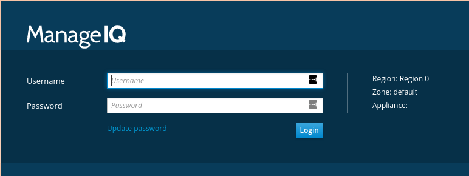
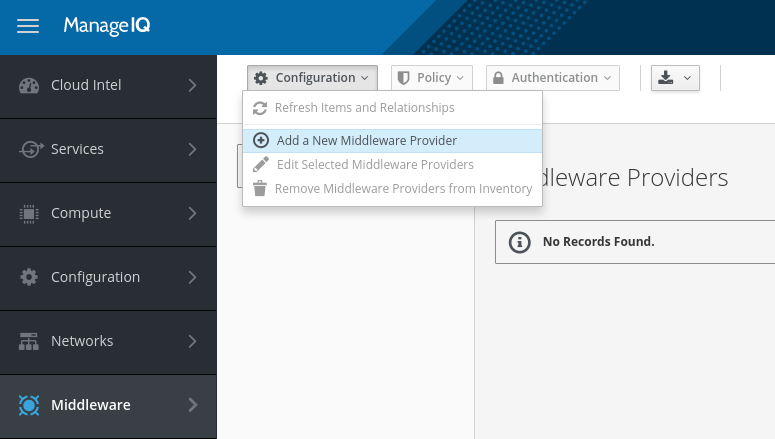
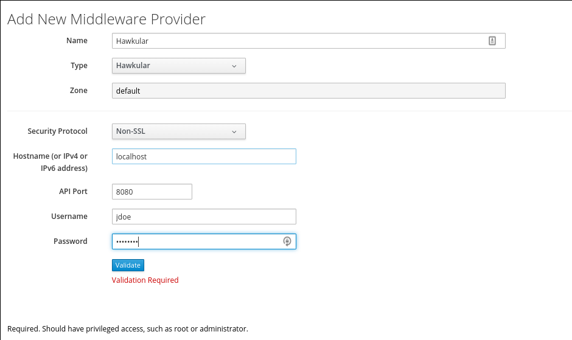
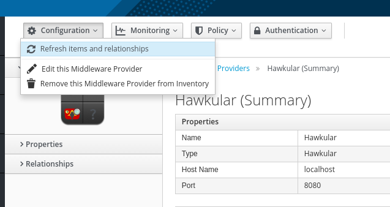

# Getting Started

This is a quick guide outlining all the necessary steps to get ManageIQ up and
running for development.

## Dependencies

* Ruby 2.3.1+ (Ruby 2.4.1 recommended)
* Bundler 1.15.3+
* PostgreSQL 9.5+
* Memcached
* Node/npm and the usual suspects: Bower, Yarn, Gulp, Webpack
* Docker
* 16gb RAM (8gb or less is doable, but not recommended)

Any Linux/OS X System is compatible, as far as we are concerned.

## Installing Dependencies

### Fedora

First, install all system dependencies:

```bash
sudo dnf install -y git-all memcached postgresql-devel postgresql-server postgresql-contrib bzip2 libffi-devel readline-devel sqlite-devel nodejs gcc-c++ libcurl-devel npm openssl-devel cmake openscap
```

Then, install npm packages required for the UI:

```bash
sudo npm install -g bower yarn webpack gulp
```

Start Memcached:

```bash
sudo systemctl enable memcached && sudo systemctl start memcached
```

Then, configure, install and run PostgreSQL:

```bash
sudo postgresql-setup --initdb --unit postgresql
sudo grep -q '^local\s' /var/lib/pgsql/data/pg_hba.conf || echo "local all all trust" | sudo tee -a /var/lib/pgsql/data/pg_hba.conf
sudo sed -i.bak 's/\(^local\s*\w*\s*\w*\s*\)\(peer$\)/\1trust/' /var/lib/pgsql/data/pg_hba.conf
sudo systemctl enable postgresql && sudo systemctl start postgresql
sudo su postgres -c "psql -c \"CREATE ROLE root SUPERUSER LOGIN PASSWORD 'smartvm'\""
```

### OS X

TODO.

### Installing a Ruby Runtime

There are many options to have different ruby versions running at the same
time, and while the Ruby versions in the repositories are usually up to date
enough, there's often a need to test or fix stuff in different ruby versions,
so the recommended way is to use a ruby version manager, such as
[RVM](https://rvm.io/), [Rbenv](https://github.com/rbenv/rbenv) or
[Chruby](https://github.com/postmodern/chruby).  Please refer to their
documentation on how to install. You'll need to have Ruby 2.4+ installed,
preferably 2.4.1.

After that, install bundler:

```bash
gem install bundler --no-ri --no-rdoc
```

## Cloning and configuring the application

The first necessary step is to fork the following repositories by running this command:

```bash
curl -u '<your_github_username>' https://api.github.com/repos/ManageIQ/manageiq/forks \
https://api.github.com/repos/ManageIQ/manageiq-ui-classic/forks \
https://api.github.com/repos/ManageIQ/manageiq-schema/forks \
https://api.github.com/repos/ManageIQ/manageiq-api/forks \
https://api.github.com/repos/ManageIQ/manageiq-providers-hawkular/forks \
https://api.github.com/repos/hawkular/hawkular-client-ruby/forks -d ''
```

Then, we clone them:

```bash
mkdir ~/ManageIQ && cd ~/ManageIQ
git clone git@github.com:<your_github_username>/manageiq
git clone git@github.com:<your_github_username>/manageiq-ui-classic
git clone git@github.com:<your_github_username>/manageiq-schema
git clone git@github.com:<your_github_username>/manageiq-api
git clone git@github.com:<your_github_username>/manageiq-providers-hawkular
git clone git@github.com:<your_github_username>/hawkular-client-ruby
```

And then we add the upstream remotes to fetch changes on the main codebase:

```bash
cd ~/ManageIQ

git -C ./manageiq remote add upstream git@github.com:ManageIQ/manageiq
git -C ./manageiq-ui-classic remote add upstream git@github.com:ManageIQ/manageiq-ui-classic
git -C ./manageiq-schema remote add upstream git@github.com:ManageIQ/manageiq-schema
git -C ./manageiq-api remote add upstream git@github.com:ManageIQ/manageiq-api
git -C ./manageiq-providers-hawkular remote add upstream git@github.com:ManageIQ/manageiq-providers-hawkular
git -C ./hawkular-client-ruby remote add upstream git@github.com:hawkular/hawkular-client-ruby
```

Now we need to make ManageIQ use our vendored repositories instead of the local
clone it does with Bundler. Create a file on `bundler.d` on the core repository
called `vendor.rb` (any name is OK, but we're going for consistency here).

This file is our addition to the Gemfile where we can override some gems and
add some other development dependencies without messing with the main
repository. Its contents are the following:

```ruby
override_gem 'manageiq-ui-classic', path: File.expand_path("../../manageiq-ui-classic", __dir__)
override_gem 'manageiq-schema', path: File.expand_path("../../manageiq-schema", __dir__)
override_gem 'manageiq-api', path: File.expand_path("../../manageiq-api", __dir__)
override_gem 'manageiq-providers-hawkular', path: File.expand_path("../../manageiq-providers-hawkular", __dir__)
```

We also recommend some other dependencies that might come in hand for debugging:

```ruby
gem 'pry'
gem 'pry-byebug'
```

The next step is to configure each repository:

```bash
cd ~/ManageIQ/manageiq
./bin/setup

cd ../manageiq-ui-classic
./bin/setup

cd ../manageiq-schema
./bin/setup

cd ../manageiq-api
./bin/setup

cd ../manageiq-providers-hawkular
./bin/setup

cd ../hawkular-client-ruby
bundle install
```

This should be enough. To run the application, we can run this, which will run the application on background on port 3000:

```bash
cd ~/ManageIQ/manageiq
bundle exec rake evm:start
```

Then, we can visit `http://localhost:3000` and sign in. If everything is working fine, you should see this:



Sign in with the default credentials (`admin`/`smartvm`), and you should be good to go!

## Updating the repositories

To update the repositories, you need to go on each one and run `bin/update`. This script takes care of it:

```bash
#!/bin/bash

MIQ_DIR="$HOME/ManageIQ"
OLD_PWD="$(pwd)"

cd $MIQ_DIR

for repo in $(find $MIQ_DIR -maxdepth 1 -type d)
do
  echo "Updating repo $repo..."

  cd $repo

  if [ -d .git ]; then
    git fetch -a
    git pull --rebase upstream master
    ./bin/update
    cd -
  fi
done

echo "Updating core..."

cd $MIQ_DIR/manageiq

./bin/update

cd $OLD_PWD

echo "DONE."
```

# Installing Docker

Docker is necessary to run `hawkinit`, which we will cover later. To install
it, first remove any currently installed version of Docker:

```bash
sudo dnf remove docker docker-common docker-selinux docker-engine-selinux docker-engine
```

Then, install Docker's Community Edition repository to if not installed, you
might need to install `dnf-plugins-core` to add the repos, and then update the cache:

```bash
sudo dnf config-manager --add-repo https://download.docker.com/linux/fedora/docker-ce.repo
sudo dnf makecache fast
```

And then, install Docker:

```bash
sudo dnf install docker-ce docker-compose
```

You'll also need to add yourself to the `docker` group:

```bash
sudo usermod -a -G docker `whoami`
newgrp docker # to update your groups on the session
```

After that, enable and start Docker:

```bash
sudo systemctl enable docker
sudo systemctl start docker
```

And finally, to test if everything is working ok:

```bash
docker run alpine /bin/echo OK
```

# Installing Hawkular

There are two ways of installing Hawkular: manually or via Docker. There are
use cases for both, and you can mix and match for your needs, but the simplest
way of getting it working is via Hawkinit, which downloads, configures and runs
the hawkular server, and 0+ wildfly instances with the Hawkular agent installed
and configured.

### Via Docker (recommended)

First, we need to install [hawkinit](https://github.com/hawkular/hawkinit),
a CLI tool that takes care of running a Hawkular cluster for you. You can do
that by getting it through npm, like this:

```bash
sudo npm install @hawkular/hawkinit -g
```

Then, run `hawkinit`.

For most options, the default is ok, and is the fastest way to have something
running. One important thing is that when you run hawkinit again, it will not
reuse the same images, but use new ones. If that's not the behaviour you want,
you can find the generated `docker-compose.yml` on `/tmp`.

We have prepared some basic scenarios that will get you started:
- [Hawkular Services and one mutable agent](readme_data/hawkinit/mutable-agent.json)
- [Hawkular Services and one immutable agent](readme_data/hawkinit/immutable-agent.json)

You can run them like this:

```bash
hawkinit -a readme_data/hawkinit/mutable-agent.json
```

You can find more information on [hawkinit](https://github.com/hawkular/hawkinit).

### Manually

TODO.

## Adding Hawkular as an a Provider

Now we're going to add Hawkular as an Provider to ManageIQ. To do that, first
we need to have Hawkular running, which we did on the last section. We're also
going to assume we used `hawkinit` to start the server. While that's not a
problem, custom setups might require custom configuration, so tread
accordingly.

So, with ManageIQ running, go to `http://localhost:3000`, sign in, and go on
the sidebar menu to `Middleware -> Providers`. At that screen we're going to
add a new provider, like this:



And on the next screen, we're going to set it up like this:



* Name: Doesn't matter
* Type: Hawkular
* Security Protocol: Non-SSL
* Hostname: localhost
* API Port: 8080
* Username: jdoe
* Password: password

Press the `Validate` button, and then the `Add` button in case everything goes
well with the validation, and you'll have a provider registered. It might still
take a while to fetch everything on the inventory from Hawkular. If that
doesn't happen automatically, you might have to do the refreshing manually, by
going on the provider page and clicking this:



## Further Reading and References

* ManageIQ Developer Setup: [http://manageiq.org/docs/guides/developer_setup](http://manageiq.org/docs/guides/developer_setup)
* ManageIQ Plugins Setup: [http://manageiq.org/docs/guides/developer_setup/plugins](http://manageiq.org/docs/guides/developer_setup/plugins)
* Hawkular Installation Guide: [http://www.hawkular.org/hawkular-services/docs/installation-guide/](http://www.hawkular.org/hawkular-services/docs/installation-guide/)
* Hawkinit: [http://github.com/hawkular/hawkinit](http://github.com/hawkular/hawkinit)
* HawkFX (to see the inventory): [https://github.com/pilhuhn/hawkfx](https://github.com/pilhuhn/hawkfx)
* Example WAR for deployment: [https://github.com/mtho11/hawkular-testing/blob/master/ticket-monster.war](https://github.com/mtho11/hawkular-testing/blob/master/ticket-monster.war)
* Example JDBC Driver jars:
  * [https://github.com/mtho11/hawkular-testing/blob/master/postgresql-9.4.1212.jre6.jar](https://github.com/mtho11/hawkular-testing/blob/master/postgresql-9.4.1212.jre6.jar)
  * [https://github.com/mtho11/hawkular-testing/blob/master/mysql-connector-java-5.1.41.zip](https://github.com/mtho11/hawkular-testing/blob/master/mysql-connector-java-5.1.41.zip)
